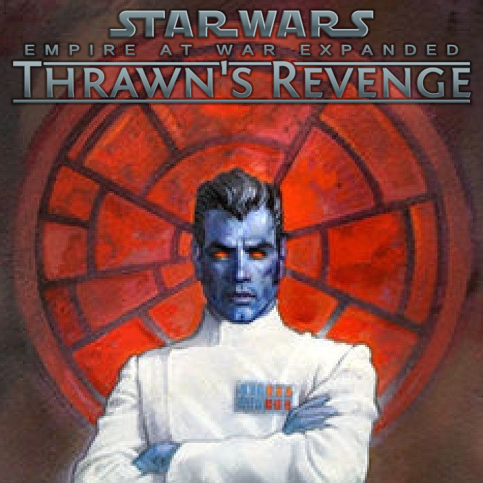

**Disclaimer**: This project is not affiliated with the EaWX team.



# template-eawx-submod

Template repository for any EaWX submod.

## Setup local

Either clone or pull to a directory, where `<URL>` is the https or SSH link to the repository.

**Clone to new directory**
```
git clone <URL>
```

**Use existing directory**
```
git init -b main
git remote add origin <URL>
git pull origin main
git branch --set-upstream-to=origin/main main
```

## Setup Upstream

Track unmodified EaWX source for easier comparing and merging.

**Create vendor branch**
```
git checkout --orphan vendor/eawx
git rm -rf .
mkdir -p mod
```

**Import and merge upstream files once**
```
git add mod
git commit -m "Import EaWX mod upstream files"
git checkout main
git merge vendor/eawx --allow-unrelated-histories
```

**Merge upstream updates**
```
git checkout main
git merge -X theirs vendor/eawx
```

## EaWX Mods

- Thrawn's Revenge (TR)
- Fall of the Republic (FotR)
- Revan's Revenge (RR)

# License

All **original code** authored in this project is available under the [MIT License](LICENSE).

This repository depends on files derived from **EaWX mods**.
See [ASSETS.md](ASSETS.md) for details on third-party content and asset usage.

### Workshop Content

The `mod/` directory contains the files uploaded to the Steam Workshop.

# Credits

Thanks to the EaWX team for creating and maintaining the EaWX mods.
